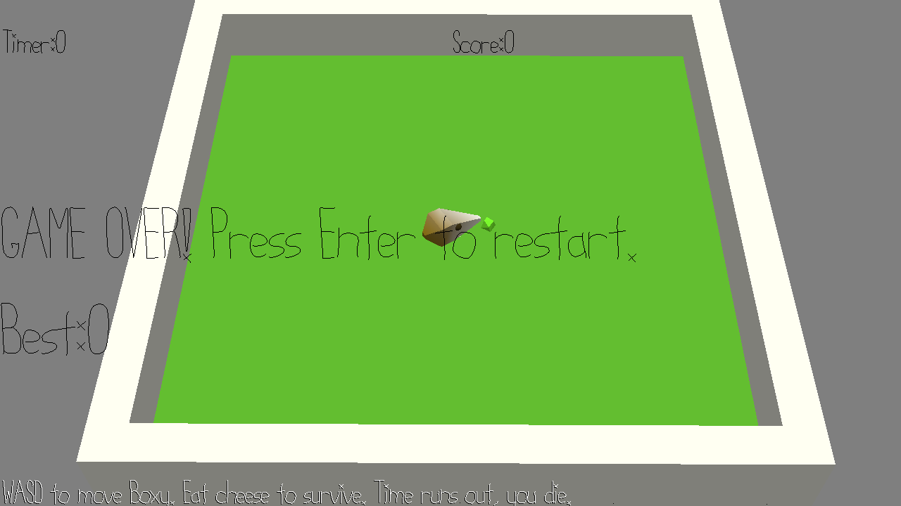

# Hungry Boxy

Author: Pavan Paravasthu

Design: Boxy is a cute little low-poly mouse with a huge metabolism, that needs to constantly eat cheese to stay alive! Eat as much cheese as you can before the timer runs out.

Screen Shot:

How To Play:

WASD moves Boxy. Enter restarts the game. Simple as that.

Sources: 
All 3D assets created with Blender v2.90
Font : PathFont, provided with base code

This game was built with [NEST](NEST.md).

